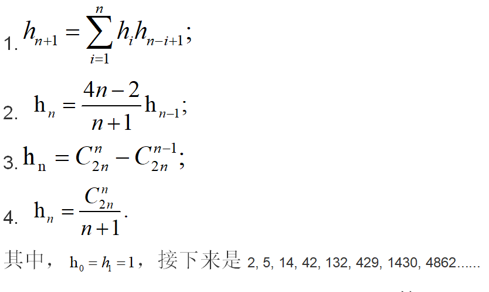
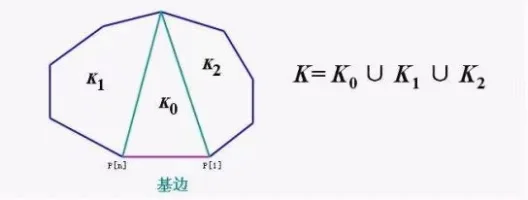
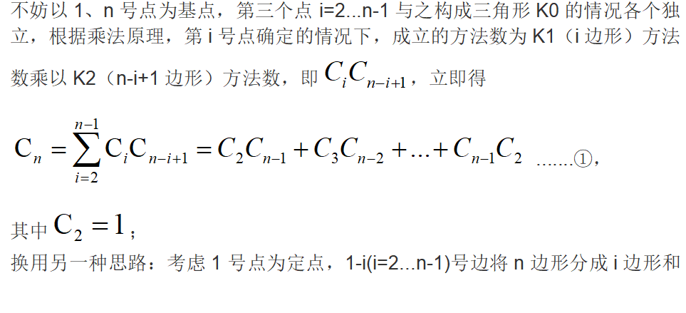
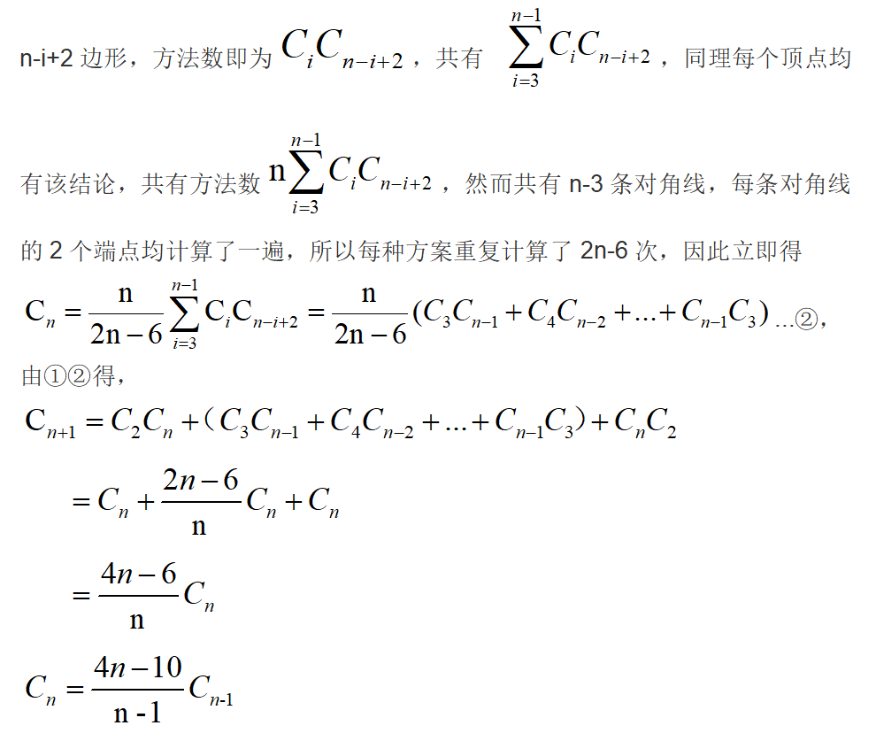
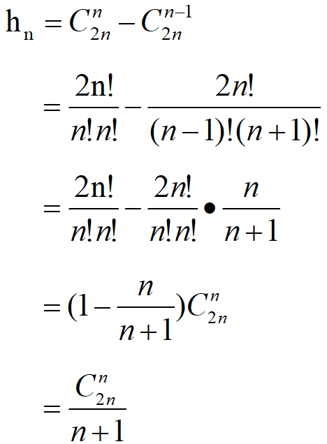
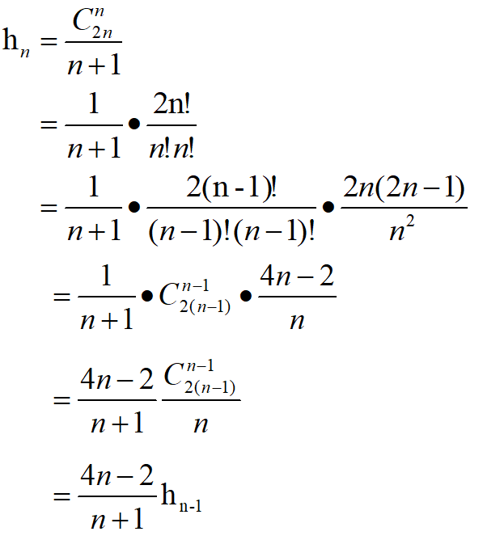

# Catalan数小总结
卡特兰(Catalan)数，是组合数学中一个常出现在各种计数问题中的数列，在信息学奥赛的递推专栏中有着重要地位，下面是我对Catalan数的一些浅薄见解。
## 递推式
 以上是Catalan数的一些常用递推式，下面我们对其推导过程进行探究。
 ## Catalan数推导过程
 ### 从模型角度
 1. 剖分三角形
 
 问题原型：给一个凸n边形，用n-3条对角线分成n-2个三角形，共有多少种分法？
 
 
 
 由上式观察得，h(n)=C(n+2)，递推式1、4得证。
 
 
 2. 出栈次序
 
    对于每一个数来说，必须进栈一次、出栈一次。我们把进栈设为状态‘1’，出栈设为状态‘0’。n个数的所有状态对应n个1和n个0组成的2n位二进制数。由于等待入栈的操作数按照1‥n的顺序排列、入栈的操作数b大于等于出栈的操作数a(a≤b)，**因此输出序列的总数目=由左而右扫描由n个1和n个0组成的2n位二进制数，1的累计数不小于0的累计数的方案种数。**在2n位二进制数中填入n个1的方案数为c(2n,n),不填1的其余n位自动填0。从中减去不符合要求（由左而右扫描，0的累计数大于1的累计数）的方案数即为所求。
    
    **不符合要求的数的特征是由左而右扫描时，必然在某一奇数位2m+1位上首先出现m+1个0的累计数和m个1的累计数**，此后的2(n-m)-1位上有n-m个 1和n-m-1个0。如若把后面这2(n-m)-1位上的0和1互换，使之成为n-m个0和n-m-1个1，结果得1个由n+1个0和n-1个1组成的2n位数，即一个不合要求的数对应于一个由n+1个0和n-1个1组成的排列。
    
    反过来，任何一个由n+1个0和n-1个1组成的2n位二进制数，由于0的个数多2个，2n为偶数，**故必在某一个奇数位上出现0的累计数超过1的累计数。**同样在后面部分0和1互换，使之成为由n个0和n个1组成的2n位数，即n+1个0和n-1个1组成的2n位数必对应一个不符合要求的数。**因而不合要求的2n位数与n+1个0，n－1个1组成的排列一一对应。**显然，不符合要求的方案数为c(2n,n-1)。由此得出输出序列的总数目=c(2n,n)-c(2n,n-1)。
    
### 从数学角度
下面我们从数学角度推导以上递推式的等价一致性。
#### 3⇔4：

#### 4⇔2：

#### 1⇔4：

f(n)=f(0)*f(n-1-0)+f(1)*(n-1-1)+f(2)*f(n-1-2)+.+f(n-1-0)*f(0)

{ f(0)=f(1)=1 }

可以利用母函数（发生函数）

令F(x)=f(0)+f(1)x+f(2)x^2+...
那么递归公式左边就是F(x)的n次项系数.右边是F(x)^2的n-1次项系数.所以我们有(注意到零次项系数这个小问题,所以加1）

F(x)=xF(x)^2+1

解出F(x)=(1+sqrt(1-4x))/2x

sqrt(1-4x)可以用广义的二项式定理展开,并且写成关于x的形式幂级数（就是无限项的多项是）,他的n次项系数就是我们要求的,恰好是C(2n,n)/(n+1)

